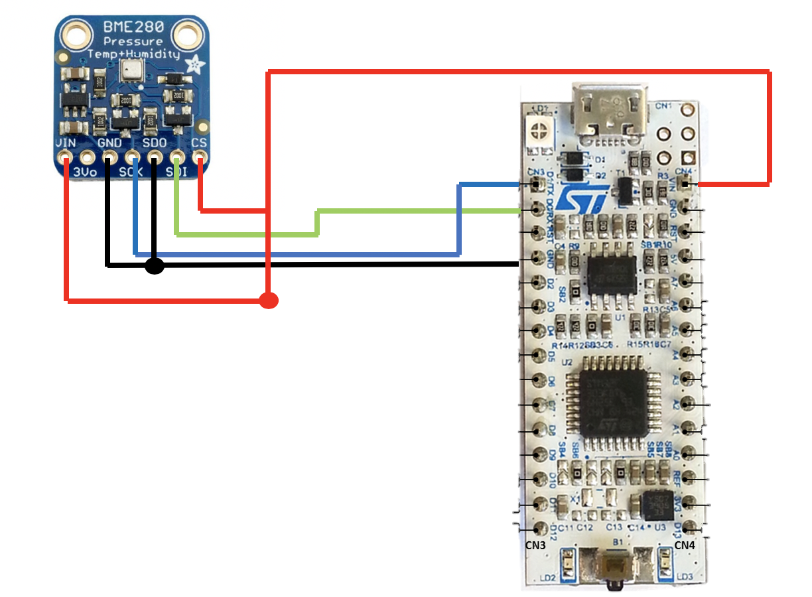

# Pinout

BME280 uses SPI and I2C but we are using I2C because it only needs 2 wires.

Because we are using I2C:
 - CS is connected to VDD (5V),
 - SD0 is connected to GND.

Because SD0 is connected to GND, the slave address is 0x76.

The full schematic:

We used D1 for Sck and D0 for Sdi because that pins of the nucleo support I2C.
